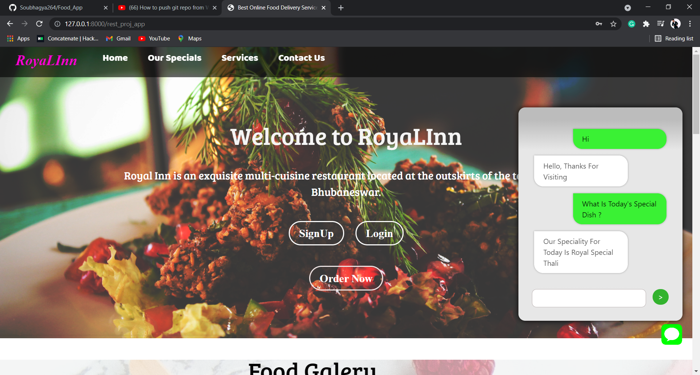
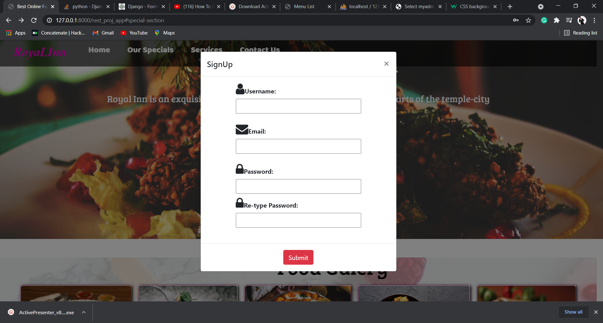
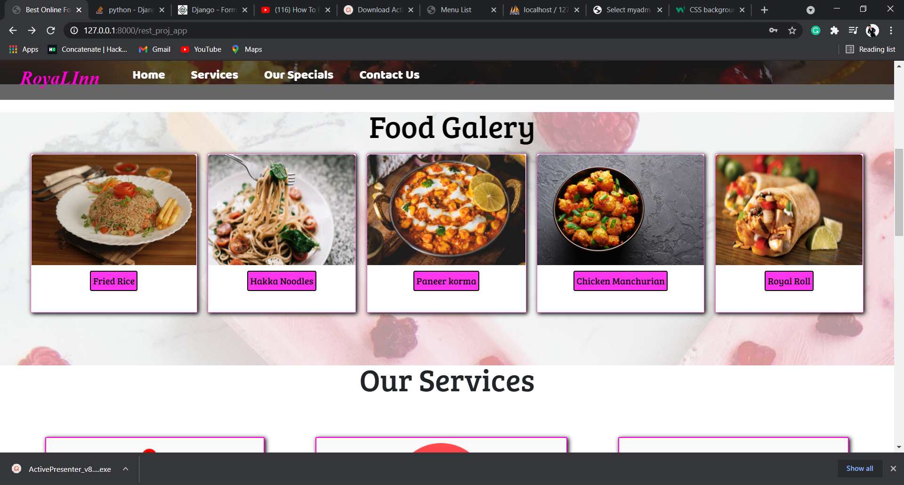
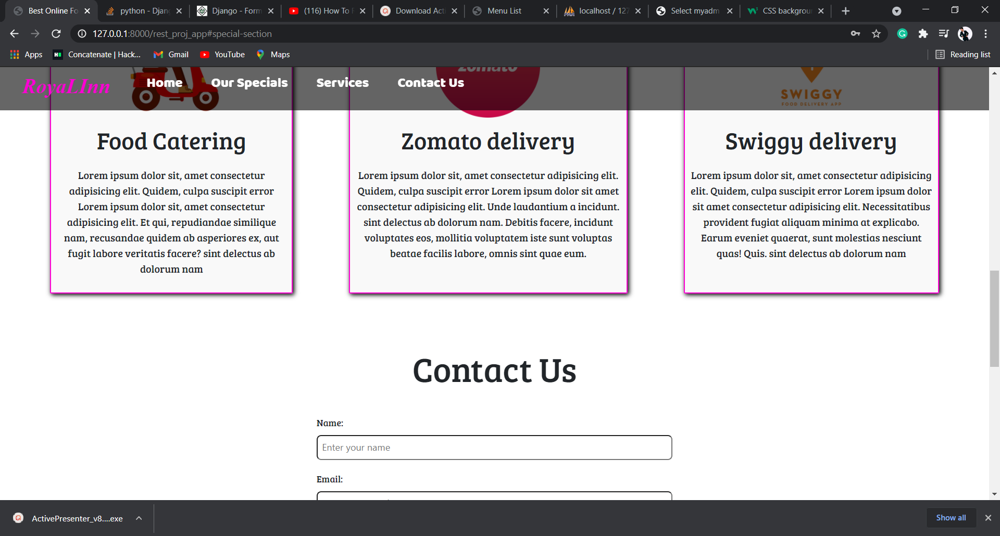
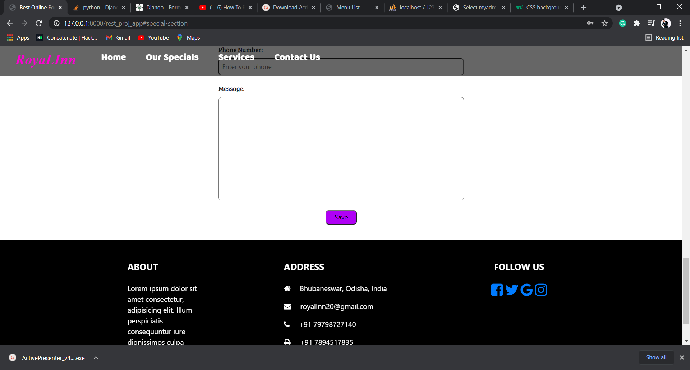
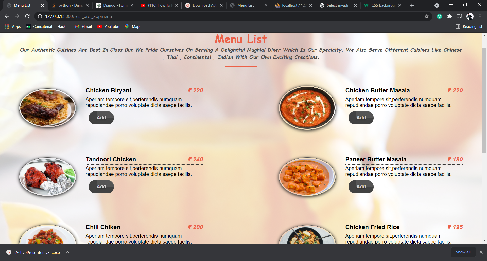
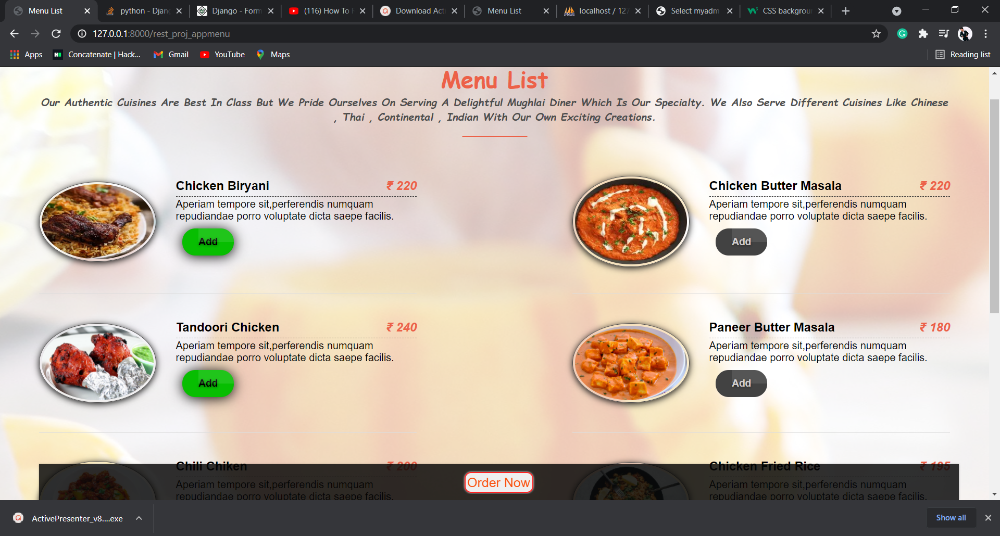
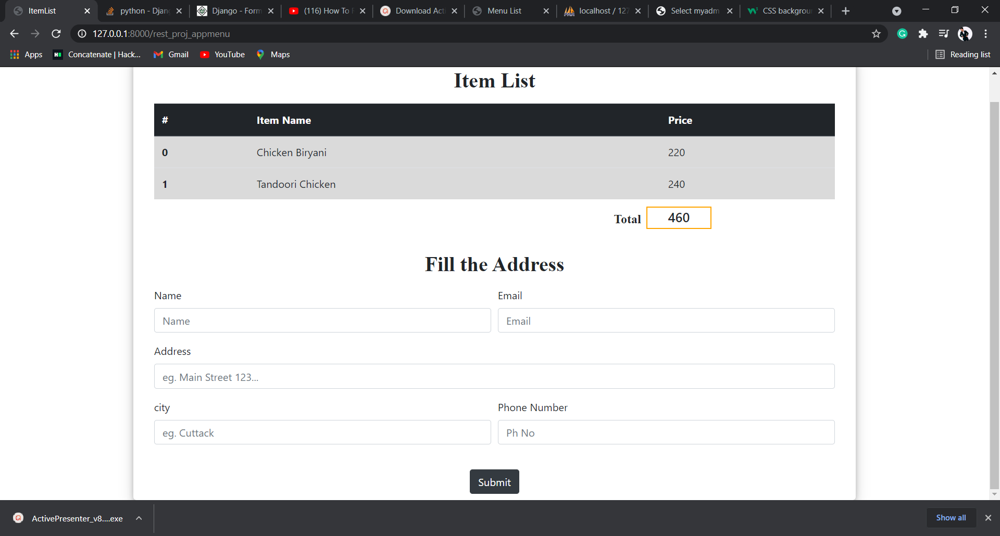

# Food_App(Using Django)
A online food delivery app for a particular restaurant using DJANGO and (HTML CSS JAVASCRIPT).A chatbot assitance also added in this website  to get the appropriate answer of all the restaurant or food related user's quaries. 

## Chatbot
A intents file had been created for training the tflearn model. Nltk library also used to preprocess the intents file. This tflearn model gives the 99% accuracy.

### Front Page of Website

##
Here you can see the chat bot messages that is visible because of ajax request to the tflearn model

### Signup page
##

### Food Galary Contact and Footer content of the page
##
 

##
This is the home page overview

## Menu Page

##
Here you can see in the menu page if the item is not being selected then you can't get into checkout page
##

##
Once you select the item then you will be able to reach out to  the check out page

## Check Out Page

##
In this page you can observe the selected Item and there price

